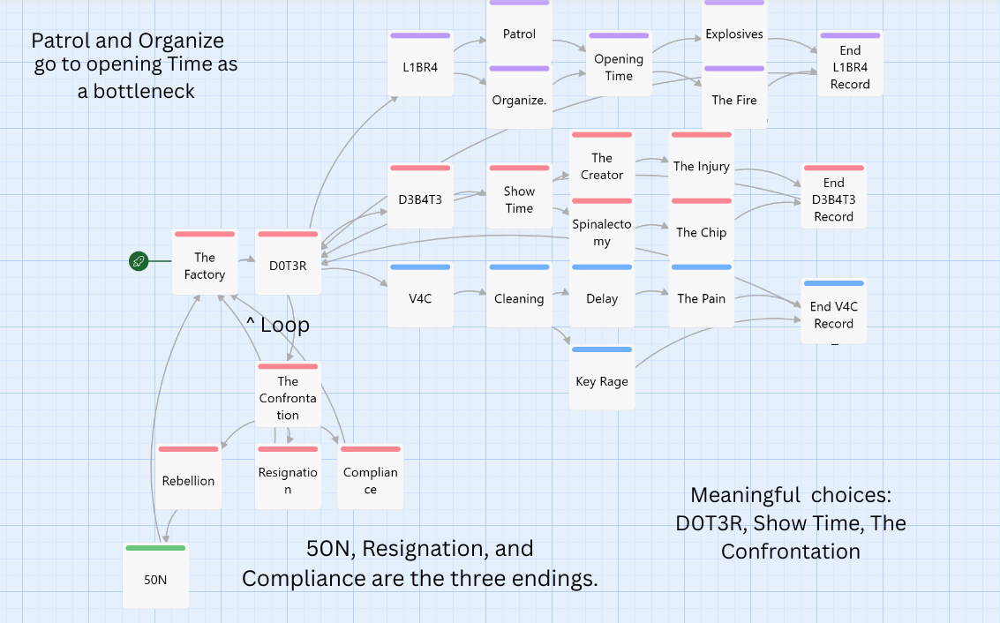

Story Map:

Playtest:

•	Tester name (first name only is fine) and relationship (“classmate,” “roommate,” etc.)
Drew - Family

•	3 observations the tester made during play (what confused them, what surprised them, what they missed)
- Colors should not blind the player (no pink)
- Buttons should be more obvisous
- Text fading was too much
- Make it obvious when reaching the end of the story

•	2 revisions the team made based on the observations

•	1 observation the team chose not to act on, and why

